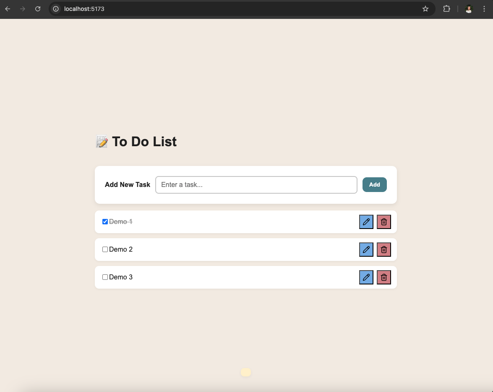

# Report - Task 002 - TO DO LIST

**Intern:** Zehra Karataş

## Implementation Summary

A simple To-Do List built with Vite, Vanilla JS, and CSS.

## Technical Details

**Key Functions**

-   onAddClick : Adds a new task
-   onToggle : Completion state of a task with checkbox
-   onEdit : Edit task with using edit button
-   onDelete : Remove task with using delete button
-   renderTasks : Renders all task dynamically

**Browser API**
localStorage API

**Folder/file Structer**

task-002/to-do-list/
├── node_modules/ (Installed dependencies)
├── src/
│ ├── main.js (Core JavaScript logic (DOM, CRUD, localStorage, a11y))
│ └── style.css (CSS styling)
├── .gitignore
├── index.html (main HTML)
├── package.json (Project metadata and dependencies for Vite)
├── package-lock.json (Auto-generated lock file for npm dependencies)
└── REPORT.md (Project documentation)

## Challenges & Solutions

-   “Add” button not working / firing twice:
    This happened because multiple event listeners were bound to the same button and input.
    Solution: Bind all add events only once inside a dedicated function

    function bindGlobalEvents() {
    addButton.addEventListener("click", onAddClick);
    input.addEventListener("keydown", (e) => {
    if (e.key === "Enter") onAddClick();
    });
    }

-   “No tasks” message stayed visible / Add didn’t work
    This happened because renderTasks() returned early when the list was empty, preventing the UI from updating.
    Solution: Don’t return early — just toggle the visibility of the message
    before rendering all tasks.

    if (tasks.length === 0) {
    emptyState.classList.remove("hidden");
    } else {
    emptyState.classList.add("hidden");
    }

## Screenshots



## Testing Instructions

**Getting Started**

```bash
# Clone this repository
git clone https://github.com/zehra-karatas/to-do-list.git

# Move into the project folder
cd to-do-list

# Install dependencies
npm install

# Start development server
npm run dev

```

**Functional Test Checklist**

-   Empty state (When there is no taks > No tasks yet)
-   Add a task (Empty state message hides automatically)
-   Edit a task
-   Complete a task
-   Delte a task
-   Persistence (Refresh the page for make shure that tasks stored in localStorage)
-   Accessibility (Keyboard-only: Use Tab/Shift+Tab to move focus. Enter/Space triggers buttons)
