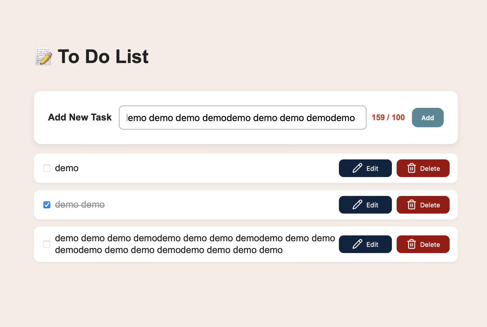

# Report - Task 004 - TODO-TS

**Intern:** Zehra Karataş

## 1. Implementation Summary

A to-do list developed using Vite + TypeScript to perform CRUD operations.

## 2. Technical Details

-   Language: Vite + TypeScript + Vanilla JS + CSS + HTML
-   Main Files:
    -   `index.html` → Page structure
    -   `main.ts` → Entry point of the application
    -   `style.css` → Layout, visual design
    -   `app.ts` → Core logic, event handling
    -   `render.ts` → Task list rendering
    -   `inline-edit.ts` → In-place task editing

## 3. Challenges & Solutions

-   Challenge: The long text input is being cut off in the linked line, and the entire text content is not visible.
-   Solution: Define a counter to limit the text to a specific length, placing it so that it can be displayed in two lines. This is also consistent for the to-do structure.

## 4. Screenshots

## 5. Testing Instructions

1. Run the project locally.
2. Add new task.
3. Edit a task inline and press Enter or Save to confirm.
4. Delete a task and ensure it remove from the list.
5. Mark a task as complete and verify text is crossed out.
6. Refresh the page and check that task are permanent through localStorage.
